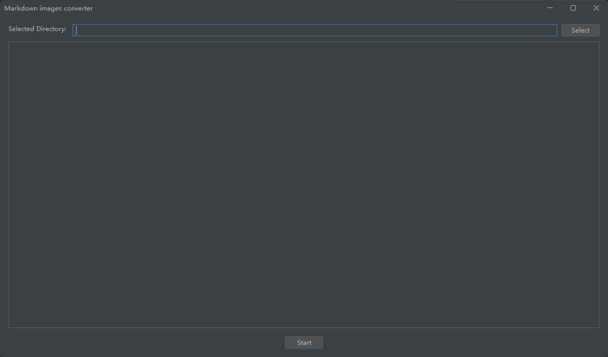

# markdown-images-converter
A tool that helps you handle markdown image syntax, for example, converting image links from online to local.

## Features

- Batch Download: markdown-images-converter can download all image links in the selected folder's markdown files to a specified local folder and automatically convert the image links.

## Quick Start

1. Download JDK, at least version 21.
2. Run the command: `java -jar markdown-images-converter-0.0.1.jar`

## Screenshot

